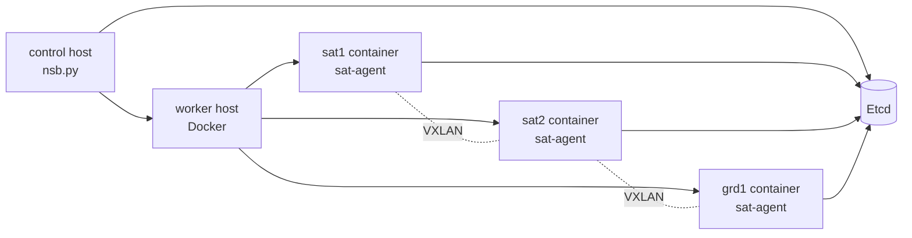
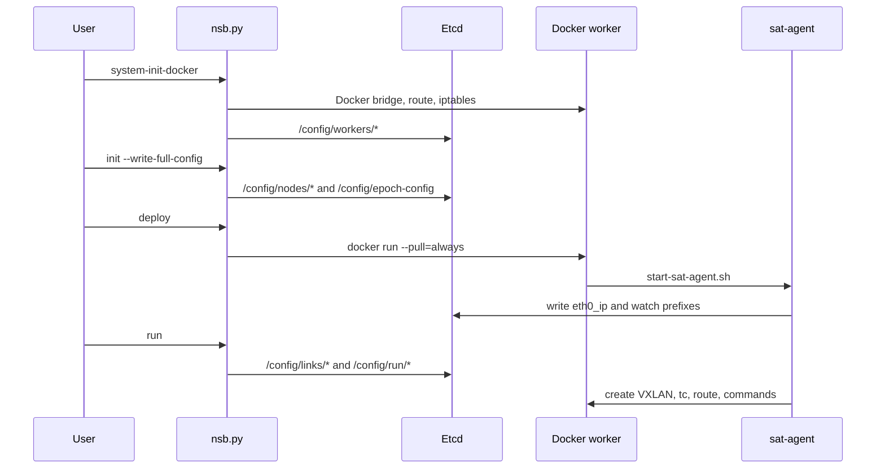

# Mimari ve Adresleme Modeli

NetSatBench'i hızlı kurmanın sırrı Python paketlerinden çok ağ modelini doğru anlamaktır. Platform üç parçalı bir kontrol düzlemi kullanır:

- `nsb.py`: control host üzerinde çalışan orkestrasyon CLI'si
- `Etcd`: global durum deposu
- `sat-agent`: her node containerı içinde çalışan ajan

Veri düzleminde ise node containerları Docker bridge underlay üzerinde IP alır. Emüle edilen uydu linkleri bu underlay IP'leri arasında VXLAN tünelleri olarak kurulur. Link karakteristikleri `tc netem` ile uygulanır.



## Etcd Keyspace

NetSatBench durumunu `/config` altında tutar:

| Prefix | Kim yazar? | Ne taşır? |
|---|---|---|
| `/config/workers/` | `system-init-docker.py` | Worker host IP, SSH, Docker bridge, kapasite |
| `/config/nodes/` | `nsb-init.py`, sonra `sat-agent` | Node config, worker placement, overlay CIDR, `eth0_ip` |
| `/config/epoch-config` | `nsb-init.py` | Epoch dizini ve dosya pattern'i |
| `/config/links/` | `nsb-run.py` | O anki VXLAN link olayları |
| `/config/run/` | `nsb-run.py` | Node içinde çalıştırılacak komutlar |
| `/config/etchosts/` | `sat-agent` | Node adı ile overlay IP eşleşmesi |

`deploy` başarılı sayılmadan önce node'ların Etcd'deki `/config/nodes/<node>` değerine `eth0_ip` yazması beklenir. Bu alan VXLAN tünellerinde remote endpoint olarak kullanılır.

## Üç Ayrı IP Alanı

| Alan | Örnek | Nerede kullanılır? | Kritik not |
|---|---|---|---|
| Yönetim IP'si | `10.0.1.215` | SSH, Etcd client URL, worker `ip` alanı | Host'un gerçek erişilebilir IP'si olmalı |
| Docker bridge underlay | `172.20.0.0/24` | Container `eth0` IP'leri | `sat-vnet-cidr` ile verilir |
| Docker supernet | `172.20.0.0/16` | Worker subnetlerini kapsar | Fiziksel ağlarla çakışmamalı |
| Overlay IPv4 | `172.100.0.0/16` | VXLAN üstündeki node L3 adresleri | Underlay ile çakışmamalı |
| Overlay IPv6 | `2001:db8:100::/48` | IPv6 senaryoları | Örneklerde opsiyonel |

Pratik tek VM modeli:

```text
Host IP:             10.0.1.215
Etcd advertise URL:  http://10.0.1.215:2379
Docker bridge:       sat-vnet, gateway 172.20.0.1
Container eth0:      172.20.0.2, 172.20.0.3, ...
Overlay blocks:      172.100.0.0/16, 172.101.0.0/16, 172.102.0.0/16
```

## Yaşam Döngüsü



## Tasarım Kuralları

- `ETCD_HOST` control host'un Etcd'ye eriştiği endpoint'tir.
- `NODE_ETCD_HOST` containerların Etcd'ye eriştiği endpoint'tir. Tek VM'de genellikle `ETCD_HOST` ile aynıdır.
- `advertise-client-urls` değeri clientların gerçekten erişebileceği adres olmalıdır. `127.0.0.1` veya `0.0.0.0` advertise etmek lab dışındaki clientlar için sorun çıkarır.
- `sat-vnet-super-cidr`, host fiziksel ağıyla ve overlay CIDR'leriyle çakışmamalıdır.
- Çok-worker ortamında workerlar arası container-source trafik engellenmemelidir. Bulutlarda anti-spoofing, allowed address pair veya route table gerekebilir.

