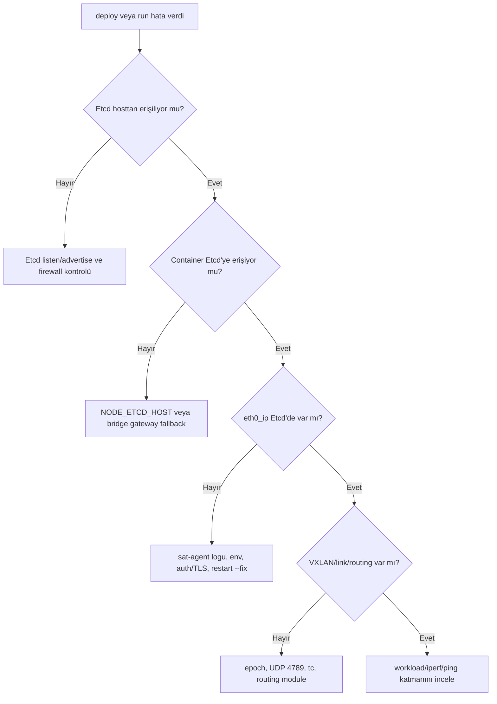

# Troubleshooting

Bu sayfa symptom odaklıdır. Önce en yakın belirtiyi bulun, sonra ilgili kontrolleri sırayla çalıştırın.

## Karar Ağacı



## Etcd Hosttan Erişilemiyor

Kontrol:

```bash
curl -sS --max-time 3 "http://$ETCD_HOST:$ETCD_PORT/version"
ETCDCTL_API=3 etcdctl --endpoints="http://$ETCD_HOST:$ETCD_PORT" endpoint health
docker logs etcd 2>&1 | grep -Ei 'advertise|listen|ready|error|warn|2379|2380'
```

Tipik düzeltme:

- `--listen-client-urls` için `http://0.0.0.0:2379`
- `--advertise-client-urls` için `http://<HOST_IP>:2379`
- `HOST_IP` gerçek yönetim IP'si olmalı
- `127.0.0.1` veya `0.0.0.0` advertise edilmemeli

## Container Etcd'ye Erişemiyor

Kontrol:

```bash
docker exec sat1 printenv | grep -E 'NODE_NAME|ETCD'
docker exec sat1 curl -sS --max-time 3 "http://$NODE_ETCD_HOST:$NODE_ETCD_PORT/version"
docker exec sat1 ip route
```

Host IP başarısız, bridge gateway başarılıysa:

```bash
export NODE_ETCD_HOST=$(docker network inspect sat-vnet | jq -r '.[0].IPAM.Config[0].Gateway')
export NODE_ETCD_PORT=2379
python3 ./nsb.py deploy --fix -t 8
```

Bridge gateway'i kullandığınız halde `curl` timeout oluyorsa host firewall'u Docker bridge kaynaklı trafiği kesiyor olabilir. Hızlı teşhis için host üzerinde:

```bash
sudo iptables -I INPUT 1 -p tcp -s 172.20.0.0/24 --dport 2379 -j ACCEPT
sudo iptables -I INPUT 1 -p tcp -s 172.20.0.0/24 --dport 2380 -j ACCEPT
```

Bu kılavuz reposundaki helper script de aynı işi idempotent şekilde yapar:

```bash
SAT_VNET_CIDR=172.20.0.0/24 /path/to/guide/scripts/05-open-etcd-firewall-for-sat-vnet.sh
```

Sonra container içinden doğrudan bridge gateway endpointini test edin:

```bash
docker exec sat1 sh -lc 'curl -v --max-time 3 http://172.20.0.1:2379/version'
```

Beklenen başarılı cevap:

```json
{"etcdserver":"3.5.17","etcdcluster":"3.5.0"}
```

Bu çalışırsa asıl problem firewall/iptables katmanıdır. `172.20.0.0/24` ve `172.20.0.1` değerlerini kendi `sat-vnet-cidr` ve Docker bridge gateway değerlerinizle eşleştirin.

## `eth0_ip` Eksik

Belirti:

```text
Some nodes did not report their eth0_ip in Etcd within the expected time
```

Kontroller:

```bash
ETCDCTL_API=3 etcdctl --endpoints="http://$ETCD_HOST:$ETCD_PORT" \
  get /config/nodes/sat1 --print-value-only | jq .

docker exec sat1 ip -4 addr show eth0
docker exec sat1 pgrep -fa sat-agent.py
docker inspect sat1 --format '{{json .State.Health}}' | jq .
```

Yorum:

| Durum | Anlam |
|---|---|
| Container `eth0` IP var, Etcd'de `eth0_ip` yok | Container -> Etcd erişimi veya auth/TLS/env sorunu |
| Container `eth0` IP yok | Docker bridge veya deploy sorunu |
| `eth0_ip` var, link yok | Epoch, VXLAN, routing veya `sat-agent` event logu incelenmeli |

`sat-agent` logu:

```bash
docker exec sat1 bash -lc '
  screen -S SATAGENT -p win0 -X hardcopy /tmp/satag.log &&
  grep -Ei "etcd|error|fail|warn|vxlan|route|hosts" /tmp/satag.log || true
'
```

## Docker Healthy Ama Ağ Bozuk

Node imajındaki healthcheck yalnız `sat-agent.py` sürecini arar. Bu yüzden `healthy` tek başına yeterli değildir.

Ek kontroller:

```bash
docker exec sat1 pgrep -fa sat-agent.py
docker exec sat1 ip link show type vxlan
docker exec sat1 tc qdisc show
python3 ./nsb.py inspect -v
python3 ./nsb.py status -v
```

## Image Pull Hatası

`deploy` containerları `--pull=always` ile başlatır. Worker registry'ye çıkamıyorsa deploy kırılır.

Kontrol:

```bash
docker pull msvcbench/sat-container:latest
```

Çok-worker ortamında bu komut her worker üzerinde başarılı olmalıdır.

## Overcommit

Belirti:

- Scheduler node yerleştiremiyor
- Container memory/cpu limitleri yüzünden stabil değil
- Tek worker `2GiB` RAM ile 10 node denemesi dar kalıyor

Düzeltme:

- Tek VM worker configte `cpu: "4"`, `mem: "8GiB"` ile başlayın.
- `sat-config.json` içindeki `cpu-request` ve `mem-request` değerlerini azaltmadan önce sistemin stabil çalıştığını görün.
- Placement değiştiyse temiz zincir kullanın: `rm`, Etcd `/config` temizliği, `init`, `deploy`.

## TLS ve Auth

İlk lab için plain HTTP Etcd önerilir. TLS/auth kullanacaksanız control host ve node container env değerlerini birlikte düşünün:

```bash
export ETCD_USER='...'
export ETCD_PASSWORD='...'
export ETCD_CA_CERT='/absolute/path/to/ca.crt'
```

İncelenen kaynak akışında node tarafına CA cert kopyalama `ETCD_USER`, `ETCD_PASSWORD` ve `ETCD_CA_CERT` birlikte verildiğinde çalışır. Sadece CA cert ile auth'suz TLS ilk lab için riskli yoldur.

## VXLAN ve Firewall

Resmi dokümanlar underlay ağının container subnetleri arası doğrudan erişime izin vermesini ister. Kaynak kodda VXLAN linkleri UDP `4789` ile oluşturulur.

Çok-worker ortamında doğrulayın:

```bash
sudo iptables -S DOCKER-USER
ip route
sudo tcpdump -ni any udp port 4789
```

Bulut ortamında ek olarak:

- Security group/firewall kuralları
- Anti-spoofing veya allowed-address-pair davranışı
- Worker `sat-vnet-cidr` subnetlerine route table
- MTU ve encapsulation overhead

## README ile Kod Arasındaki İsim Farkları

| README'de görülebilir | Gerçek kullanım |
|---|---|
| `examples/10nodes/workers-config.json` | `examples/10nodes/worker-config.json` |
| `system-cleanup-docker` | `system-clean-docker` |
| `docs/contro-commands.md` linki | `docs/control-commands.md` |
