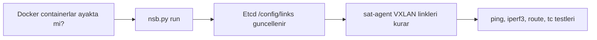

# Kullanım ve Test Örnekleri

Bu bölüm kurulumdan sonra NetSatBench emülatörünü nasıl okuyacağınızı, nasıl çalıştıracağınızı ve temel testleri nasıl yapacağınızı anlatır. Örnekler `examples/10nodes` senaryosu ve tek VM worker modeli içindir.

Örnek lab IP'si:

```bash
export ETCD_HOST="10.193.220.49"
export ETCD_PORT="2379"
export NODE_ETCD_HOST="$ETCD_HOST"
export NODE_ETCD_PORT="$ETCD_PORT"
```

Kendi ortamınızda `10.193.220.49` yerine gerçek worker/control host IP'nizi kullanın.

## Günlük Akış

Kurulum tamamlandıktan sonra tipik kullanım sırası:

```bash
docker ps --format "table {{.Names}}\t{{.Status}}\t{{.Networks}}"

python3 ./nsb.py exec sat1 hostname
python3 ./nsb.py exec usr1 hostname
python3 ./nsb.py exec grd1 hostname

python3 ./nsb.py run

python3 ./nsb.py exec usr1 ping -c 4 grd1
python3 ./nsb.py exec usr1 ip route show
python3 ./nsb.py exec sat1 ip -br addr
```

`nsb.py run` epoch dosyalarını işler. Linkler statik bir çizim gibi değil, epoch JSON dosyalarındaki `links-add`, `links-update`, `links-del` ve `run` olaylarına göre zaman içinde oluşur.



## Örnek 10 Node Topolojisi

`examples/10nodes` senaryosunda beklenen node'lar:

| Node | Rol |
|---|---|
| `sat1` - `sat8` | Satellite node |
| `grd1` | Gateway / yer istasyonu |
| `usr1` | User terminal |

Tek VM lab'da hepsi aynı worker üzerinde çalışır:

```text
host-1 -> 10.193.220.49
```

Zihinsel model:

```text
usr1  -> user terminal
grd1  -> gateway / ground station
sat*  -> satellite nodes
```

Gerçek aktif linkleri görmek için topoloji çizimine değil, Etcd'deki `/config/links/` alanına ve epoch dosyalarına bakın.

## IP Katmanları

Üç ayrı IP dünyası vardır:

| Katman | Örnek | Anlam |
|---|---|---|
| Host/worker IP | `10.193.220.49` | Gerçek Ubuntu VM, SSH, Etcd endpoint |
| Docker underlay | `172.20.0.0/24` | Container `eth0` ağı, `sat-vnet` |
| Emulated overlay | `172.100.0.0/16`, `172.101.0.0/16`, `172.102.0.0/16` | Uydu/gateway/user L3 alanları |

Örnek otomatik atamalar:

| Node | Rol | Emulated CIDR |
|---|---|---|
| `sat1` | satellite | `172.100.0.0/30` |
| `sat2` | satellite | `172.100.0.4/30` |
| `sat3` | satellite | `172.100.0.8/30` |
| `sat4` | satellite | `172.100.0.12/30` |
| `sat5` | satellite | `172.100.0.16/30` |
| `sat6` | satellite | `172.100.0.20/30` |
| `sat7` | satellite | `172.100.0.24/30` |
| `sat8` | satellite | `172.100.0.28/30` |
| `grd1` | gateway | `172.101.0.0/30` |
| `usr1` | user | `172.102.0.0/30` |

## Node Listesini Görme

Docker tarafı:

```bash
docker ps --format "table {{.Names}}\t{{.Status}}\t{{.Networks}}"
```

Etcd tarafı:

```bash
ETCDCTL_API=3 etcdctl \
  --endpoints="http://$ETCD_HOST:$ETCD_PORT" \
  get /config/nodes/ --prefix --keys-only
```

Beklenen anahtarlar:

```text
/config/nodes/sat1
/config/nodes/sat2
...
/config/nodes/grd1
/config/nodes/usr1
```

Tek node detayını okumak:

```bash
ETCDCTL_API=3 etcdctl \
  --endpoints="http://$ETCD_HOST:$ETCD_PORT" \
  get /config/nodes/sat1 --print-value-only | jq .
```

Burada özellikle şunları arayın:

- `type`
- `worker`
- `L3-config`
- `cidr`
- `eth0_ip`

`eth0_ip` yoksa container kendi Docker underlay IP'sini Etcd'ye yazamamış demektir.

## Aktif Linkleri Görme

Aktif epoch linkleri:

```bash
ETCDCTL_API=3 etcdctl \
  --endpoints="http://$ETCD_HOST:$ETCD_PORT" \
  get /config/links/ --prefix
```

Örnek link kaydı:

```json
{
  "endpoint1": "sat1",
  "endpoint2": "sat2",
  "rate": "10mbit",
  "loss": 0,
  "delay": "1ms",
  "vni": 13475210
}
```

Canlı izlemek için bir terminalde:

```bash
ETCDCTL_API=3 etcdctl \
  --endpoints="http://$ETCD_HOST:$ETCD_PORT" \
  watch /config/links/ --prefix
```

Başka terminalde:

```bash
python3 ./nsb.py run
```

Bu yöntem emülatörün linkleri ne zaman eklediğini, güncellediğini veya sildiğini doğrudan gösterir.

## Container İçinden İnceleme

Bir node içine interaktif girin:

```bash
python3 ./nsb.py exec -it sat1 bash
```

İçeride:

```bash
ip -br addr
ip -br link
ip route
tc qdisc show
cat /etc/hosts
```

Beklenen arayüzler:

| Arayüz | Anlam |
|---|---|
| `eth0` | Docker `sat-vnet` underlay arayüzü |
| `lo` | Loopback ve overlay node IP'si |
| `vl_*` | VXLAN emulated link arayüzleri |

Örneğin `vl_sat2_1` gibi bir interface görürseniz bu `sat1` ile `sat2` arasındaki emulated linklerden biri olabilir.

## Ping Testleri

User'dan gateway'e:

```bash
python3 ./nsb.py exec usr1 ping -c 4 grd1
```

Satellite-to-satellite:

```bash
python3 ./nsb.py exec sat1 ping -c 4 sat2
```

Gateway'den user'a:

```bash
python3 ./nsb.py exec grd1 ping -c 4 usr1
```

Ping çalışmazsa önce şu üç şeyi kontrol edin:

```bash
python3 ./nsb.py exec usr1 cat /etc/hosts
python3 ./nsb.py exec usr1 ip route
python3 ./nsb.py exec usr1 ip -br addr
```

İsim çözümleme çoğunlukla `/etc/hosts` kayıtları üzerinden yapılır.

## iperf3 Trafik Testi

Gateway üzerinde server:

```bash
python3 ./nsb.py exec grd1 iperf3 -s -D
```

User terminalden gateway'e TCP test:

```bash
python3 ./nsb.py exec usr1 iperf3 -c grd1 -t 30 -i 2
```

UDP test:

```bash
python3 ./nsb.py exec usr1 iperf3 -u -c grd1 -b 5M -t 20 -i 2
```

Linkte `rate: 10mbit` varsa iperf sonucunun yaklaşık bu sınıra yakın olması beklenir. Çok düşük sonuçlarda `/config/links/`, routing tablosu ve `tc qdisc` çıktısını birlikte kontrol edin.

## Gecikme ve Loss Doğrulama

Aktif VXLAN interface'lerini bulun:

```bash
python3 ./nsb.py exec sat1 ip -br link
```

Örnek interface için netem ayarını okuyun:

```bash
python3 ./nsb.py exec sat1 tc qdisc show dev vl_sat2_1
```

Beklenen çıktı içinde şuna benzer değerler görmelisiniz:

```text
netem delay 1ms loss 0%
```

Bu çıktı epoch dosyasındaki link delay/loss değerinin container içinde uygulanıp uygulanmadığını doğrular.

## Routing Kontrolleri

IPv4 route tablosu:

```bash
python3 ./nsb.py exec sat1 ip route
python3 ./nsb.py exec sat2 ip route
python3 ./nsb.py exec usr1 ip route
python3 ./nsb.py exec grd1 ip route
```

FRRouting süreçleri:

```bash
python3 ./nsb.py exec sat1 ps aux | grep -E "zebra|isisd|frr"
```

`vtysh` kullanılabiliyorsa:

```bash
python3 ./nsb.py exec sat1 vtysh -c "show ip route"
python3 ./nsb.py exec sat1 vtysh -c "show isis neighbor"
python3 ./nsb.py exec sat1 vtysh -c "show isis database"
```

## Epoch Dosyalarını Okuma

Epoch dosyalarını listeleyin:

```bash
ls ./examples/10nodes/epochs
```

İçeriği okuyun:

```bash
jq . ./examples/10nodes/epochs/NetSatBench-epoch0.json
```

Aranacak alanlar:

| Alan | Anlam |
|---|---|
| `links-add` | Yeni link oluştur |
| `links-update` | Mevcut link rate/delay/loss değerini değiştir |
| `links-del` | Linki sil |
| `run` | Node içinde komut çalıştır |

## Beş Mini Deney

### 1. Node Haritası

```bash
for n in sat1 sat2 sat3 sat4 sat5 sat6 sat7 sat8 grd1 usr1; do
  echo "===== $n ====="
  python3 ./nsb.py exec "$n" ip -br addr
done
```

Amaç: Her emulated cihazın interface ve IP yapısını görmek.

### 2. Etcd Canlı Link İzleme

Terminal 1:

```bash
ETCDCTL_API=3 etcdctl \
  --endpoints="http://$ETCD_HOST:$ETCD_PORT" \
  watch /config/links/ --prefix
```

Terminal 2:

```bash
python3 ./nsb.py run
```

Amaç: Epoch işlendikçe link olaylarını canlı görmek.

### 3. Ping ve Netem Karşılaştırması

```bash
python3 ./nsb.py exec sat1 ping -c 10 sat2
python3 ./nsb.py exec sat1 tc qdisc show
```

Amaç: Ping RTT ile `tc/netem` delay değerleri arasında bağ kurmak.

### 4. Bandwidth Testi

```bash
python3 ./nsb.py exec grd1 iperf3 -s -D
python3 ./nsb.py exec usr1 iperf3 -c grd1 -t 20 -i 2
```

Amaç: Emulated link rate değerinin throughput'a etkisini görmek.

### 5. Epoch Değişimini İzleme

```bash
watch -n 1 'docker exec sat1 ip route'
```

veya:

```bash
watch -n 1 'docker exec sat1 ip -br link'
```

Amaç: Link ve route durumunun zamanla değişimini izlemek.

## Beklenen Sonuç Tablosu

| Komut | Beklenen işaret |
|---|---|
| `docker ps` | `sat*`, `grd1`, `usr1` containerları `Up` ve mümkünse `healthy` |
| `etcdctl get /config/nodes/sat1` | JSON içinde `eth0_ip` |
| `etcdctl get /config/links/ --prefix` | Endpoint, rate, delay, loss, vni bilgileri |
| `nsb.py exec usr1 ping -c 4 grd1` | `0% packet loss` |
| `nsb.py exec usr1 iperf3 -c grd1` | Link rate'e yakın throughput |
| `nsb.py exec sat1 tc qdisc show` | `netem delay`, varsa `loss`, `rate` |
| `nsb.py exec sat1 vtysh -c "show isis neighbor"` | Routing aktifse neighbor bilgisi |

## Ekran Görüntüsü Önerileri

Ekran görüntüsü eklemek isterseniz dosyaları `assets/screenshots/` altına koyun. Reponun sade kalması için 5-7 görüntü yeterli olur:

| Dosya adı önerisi | Ne göstermeli? |
|---|---|
| `01-docker-ps.png` | `docker ps` ile node containerları |
| `02-etcd-nodes-sat1.png` | `/config/nodes/sat1` JSON ve `eth0_ip` |
| `03-etcd-links-watch.png` | `/config/links/` watch çıktısı |
| `04-container-ip-link.png` | `sat1` içinde `ip -br addr` ve `ip -br link` |
| `05-ping-usr1-grd1.png` | `usr1 -> grd1` ping testi |
| `06-iperf3-usr1-grd1.png` | iperf3 throughput testi |
| `07-tc-qdisc-vxlan.png` | VXLAN interface üstünde `tc qdisc` |

Görüntüleri ekledikten sonra bu sayfaya kısa başlıklarla bağlamak yeterli; uzun ekran görüntüsü galerisi oluşturmaya gerek yok.

## En Kısa Özet

```bash
docker ps
python3 ./nsb.py run

ETCDCTL_API=3 etcdctl \
  --endpoints="http://$ETCD_HOST:$ETCD_PORT" \
  get /config/links/ --prefix

python3 ./nsb.py exec -it usr1 bash
python3 ./nsb.py exec usr1 ping -c 4 grd1
python3 ./nsb.py exec grd1 iperf3 -s -D
python3 ./nsb.py exec usr1 iperf3 -c grd1 -t 30 -i 2
python3 ./nsb.py exec sat1 ip route
python3 ./nsb.py exec sat1 tc qdisc show
```

Kısaca: elinizde 8 uydu, 1 gateway ve 1 user terminalden oluşan, epoch dosyalarıyla zaman içinde değişen küçük bir LEO ağ emülasyonu vardır. Gerçek anlık topoloji için en güvenilir kaynak `/config/links/` ve container içindeki `vl_*` VXLAN arayüzleridir.

